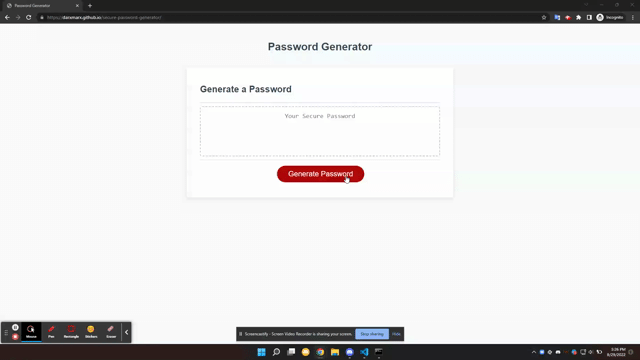

# Secure Password Generator

## Description

A website built to allow users to quickly generate secure passwords.

## Installation

First, navigate to the site: https://darxmarx.github.io/secure-password-generator/
Then, copy and paste the brand new password.

## Usage

This website serves as a convenient method for creating secure passwords between 8 and 128 characters long. By answering a simple set of dialogue boxes, a user may customize their randomly generated password by allowing or disallowing lowercase letters, uppercase letters, numbers, and special characters. Completed passwords appear in a large text box, enabling users easy access to copy and paste their new password if they so choose. 

## Screenshot

## Credits

N/A

## License

Please refer to the LICENSE in the repo.